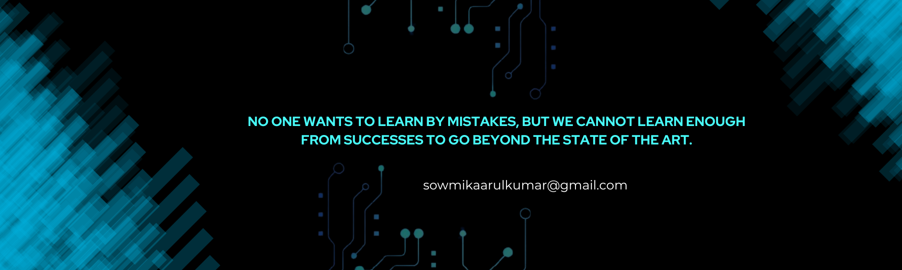

# 🚀 Welcome to My Profile! 👋

I'm **Sowmika**, an aspiring **MERN Stack Developer** and **Cloud Enthusiast**. Passionate about building scalable web applications and exploring the world of **DevOps** and **Cloud Computing**.

---

## 👩‍💻 About Me

- 🎓 **B.E. Computer Science & Engineering** @ *Kongu Engineering College, India*
- 🔭 Working on **Alumni Connect** — a project close to my heart ❤️
- 🌱 Learning **DevOps**, **AWS**, and **CI/CD pipelines**
- 💬 Ask me about: `C`, `Java`, `SQL`, `MongoDB`, `Node`, and anything curious!
- 📫 Reach out: [sowmikaarulkumar@gmail.com](mailto:sowmikaarulkumar@gmail.com)
- 📄 [Check my Resume](https://drive.google.com/file/d/1j7EA0gygg_h6meOwh4NlVe-8tZTxPEYV/view?usp=sharing)
- 🎭 **Fun Fact:** *My commit messages are poetry: ‘Fix bug’, ‘Oops’, ‘Finally works!’* 😄

---

## 🌍 Connect with Me

---

## 🛠 Tech Stack & Tools

### **Languages**

### **Frontend Development**

### **Backend Development**

### **Databases**

### **DevOps & Deployment**

### **Tools & UI/UX**

---

## 📊 GitHub Stats

---

## 🏆 GitHub Trophies

---

## ✨ Quote of the Day

---

🔥🚀 *Keep Coding and Building!* 🚀🔥
